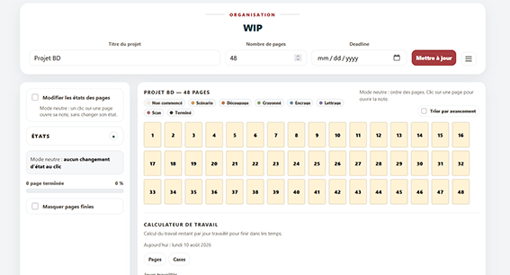
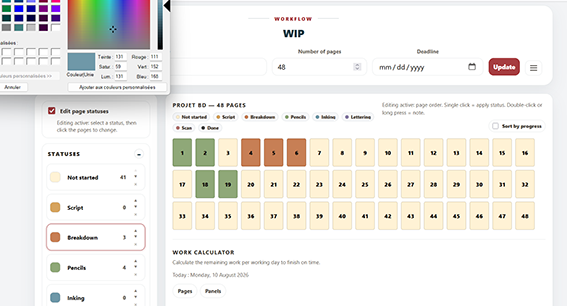
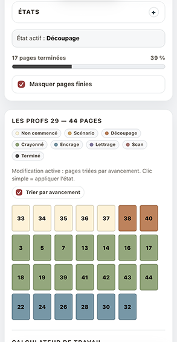
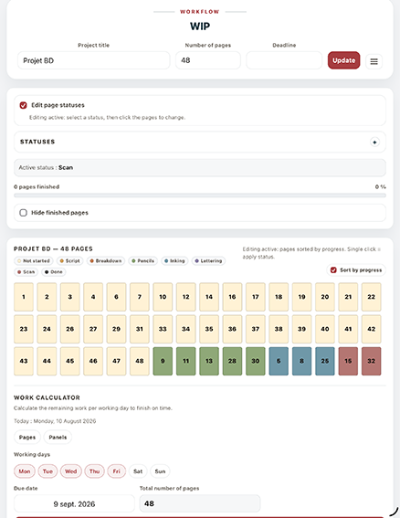
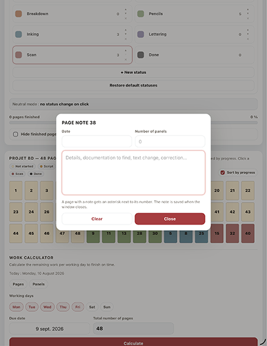
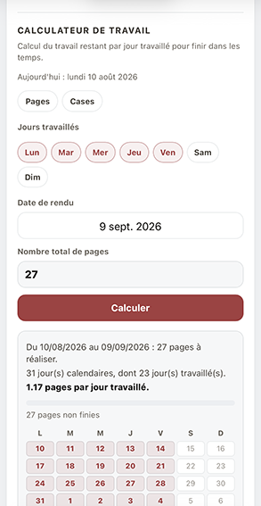

# WIP

**WIP** est une application web bilingue et autonome d’Eigrutel Lab pour suivre l’avancement d’un projet de bande dessinée page par page, organiser les étapes de production et estimer le travail restant avant une échéance.

**Version stable : 1.1.0 — 11-08-2026**

## Ouvrir l’application

**GitHub Pages**

`https://eigrutel.github.io/eigrutel-wip/wip.html`

L’application tient dans un fichier HTML autonome et fonctionne directement dans un navigateur moderne.

---

## Aperçu

### Vue générale

<table>
<tr>
<td width="50%" valign="top">

**Français**



</td>
<td width="50%" valign="top">

**English**



</td>
</tr>
</table>

### Mobile / petit écran

<table>
<tr>
<td width="50%" valign="top">

**Français**



</td>
<td width="50%" valign="top">

**English**



</td>
</tr>
</table>

### Fiche page et calculateur

<table>
<tr>
<td width="50%" valign="top">

**Fiche page / Page note**



</td>
<td width="50%" valign="top">

**Calculateur de travail / Work calculator**



</td>
</tr>
</table>

---

## Principe

Chaque page du projet est représentée par une vignette colorée correspondant à son état de production.

Les états fournis par défaut sont : **Non commencé, Scénario, Découpage, Crayonné, Encrage, Lettrage, Scan, Terminé**.

Les états intermédiaires peuvent être renommés, recolorés, ajoutés, supprimés et réordonnés. L’état **Terminé** est protégé et sert de référence aux calculs de progression et de travail restant.

## Fonctions principales

- interface bilingue français / anglais ;
- titre du projet, nombre de pages et deadline ;
- états de production personnalisables ;
- ajout, suppression et réordonnancement des états ;
- couleurs personnalisables ;
- état **Terminé** protégé ;
- tri par avancement et masquage des pages terminées ;
- progression générale du projet ;
- fiche individuelle par page ;
- changement d’état directement depuis la fiche page ;
- pastilles couleur dans le menu d’état de la fiche ;
- date, nombre de cases et précisions par page ;
- détection des liens dans les notes ;
- calculateur de travail en pages ou en cases ;
- sélection des jours travaillés ;
- prise en compte de la deadline ;
- sauvegarde locale automatique ;
- import / export JSON ;
- impression ;
- remise à zéro des pages ;
- restauration des états par défaut ;
- remise à zéro complète ;
- mini aide intégrée.

## Calculateur de travail

Le calculateur reprend la **deadline du projet** et estime le travail restant selon les jours travaillés sélectionnés.

### Pages

`nombre total de pages − pages à l’état Terminé`

### Cases

Le calculateur additionne les nombres de cases renseignés sur les pages qui ne sont pas encore à l’état **Terminé**.

## Données et sauvegarde

Les données sont enregistrées automatiquement dans le `localStorage` du navigateur. L’export JSON permet de conserver, transférer ou archiver un projet indépendamment du stockage local.

Nom du fichier exporté : `wip_nom-du-projet.json`

## Structure du dépôt

```text
wip.html
index.html
README.md
NOTICE.md
LICENSE.md
CHANGELOG.md
ARCHITECTURE.md
docs/
  images/
    wip-fr.png
    wip-en.png
    wip-mobile-fr.png
    wip-mobile-en.png
    wip-fiche.png
    wip-calcul.png
favicon/
  favwip.png
```

## Auteur

**Simon Léturgie** — programme conçu et développé dans le cadre d’**Eigrutel BD Academy**.

## Licences

- **Code :** GNU AGPL v3.0 ou version ultérieure.
- **Documentation :** CC BY-SA 4.0, sauf mention contraire.
- **Marques :** Eigrutel / Eigrutel Lab / Eigrutel BD Academy — signes distinctifs réservés.
